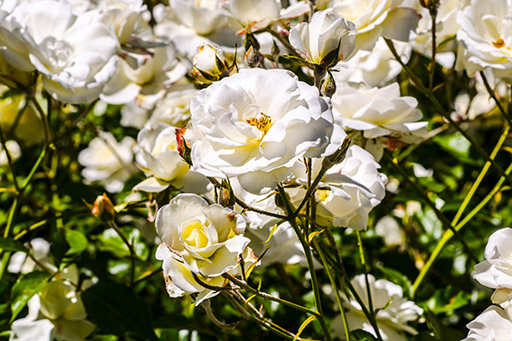
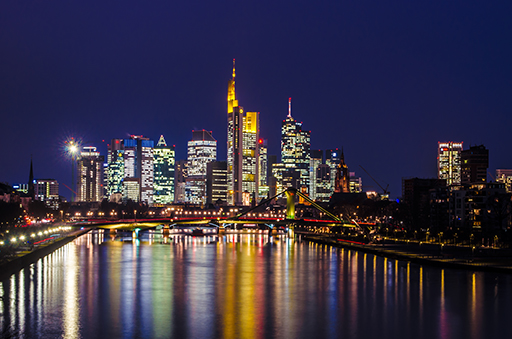
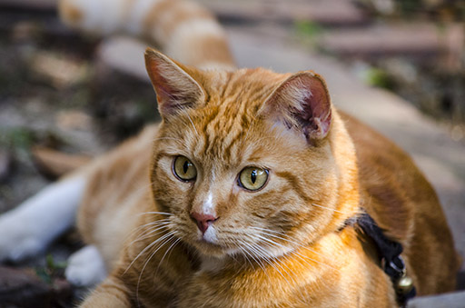
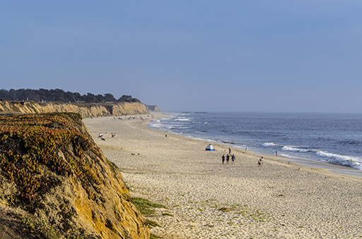
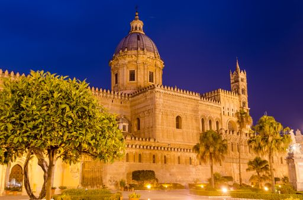
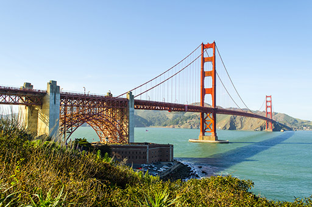

  

In my spare time, I am an avid photographer. These days, I am most active on <a href="https://www.instagram.com/voegele.martin/">Instagram</a>. You can find many of my older pictures in <a href="https://www.flickr.com/photos/141145767@N06/">my Flickr profile</a> and on <a href="https://blendenfleck.tumblr.com/">my Tumblr blog</a>. I'm also a member of the German <a href="https://www.fotocommunity.de/fotograf/blendenfleck/1786881">Photocommunity</a>.

Current equipment:
- Nikon N5100
- AF-S NIKKOR 50mm f/1.8G
- AF-S DX NIKKOR 18-55mm f/3.5-5.6G VR
- AF-S DX NIKKOR 18-140mm f/3.5-5.6G ED VR
- AF-S DX NIKKOR 55-300mm f/4.5-5.6G ED VR
- AF-S NIKKOR 80-400mm f/4.5-5.6 G ED VR

My greatest success was the second prize in a Photocommunity contest with my <a href="https://www.fotocommunity.de/photo/lesetraum-blendenfleck/27524305">picture of the public library in Stuttgart</a>.

  
