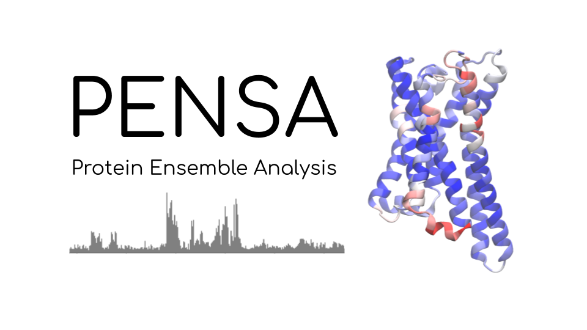

Most of the code I write as a computational scientist is one-off analysis code, mostly in Python. Whenever I think a method could be useful to others, I try to share it with the scientific community.
You can find my open-source contributions on <a href="https://github.com/martinvoegeleJ">my GitHub profile</a>.
Here I highlight some of the bigger projects that I particularly care about.

## PENSA

_Protein Ensemble Analysis_, a toolbox for exploratory analysis and comparison of structural ensembles of proteins.

 

- Compare structural ensembles of proteins via the relative entropy of their features and visualize deviations on a reference structure.
- Project ensembles on their combined principal components (PCs) and sort the structures along a PC.
- Cluster structures via k-means and via regular-space clustering and write out the resulting clusters as trajectories.

<a href="https://github.com/drorlab/pensa">View it on GitHub.</a>

## ATOM3D 
(with Raphael Townshend, Patricia Suriana, Alexander Derry)

A benchmark suite for machine learning on three-dimensional molecular structure. 

Check it out on <a href="https://www.atom3d.ai/">atom3d.ai</a> or on its <a href="https://github.com/drorlab/atom3d">GitHub page</a>.

## Binless WHAM
(with Alfredo Jost-López and Lukas Stelzl)

An efficient implementation of the binless WHAM method for statistical reweighting of biased simulations.

<a href="https://github.com/bio-phys/binless-wham">View it on GitHub.</a>

